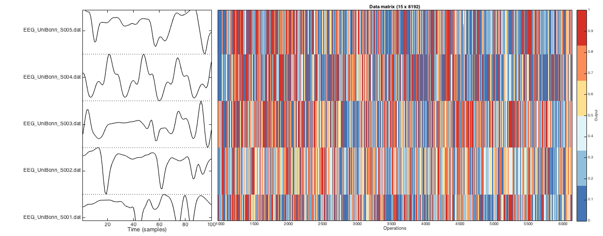

# Visualizing the data matrix

The clustered data matrix \(if clustering has been performed, otherwise the non-clustered data matrix is used\) can be visualized by running `TS_PlotDataMatrix`.

This will produce a colored visualization of the data matrix such as that shown below.

When data is grouped according to a set of distinct keywords and stored as group metadata \(using the `TS_LabelGroups` [function](grouping.md)\), these can also be visualized using `TS_PlotDataMatrix('colorGroups',true)`.

### Visualizing the normalized data matrix

Running `TS_PlotDataMatrix('norm')` plots the data contained in the local file `HCTSA_N.mat`, yielding:


where black rectangles label missing values, and other values are shown from low \(blue\) to high \(red\) after normalization using the scaled outlier-robust sigmoidal transformation. Due to the size of the matrix, operations are not labeled individually.

Examples of time series segments are shown to the left of the plot, and when the middle plot is zoomed, the time-series annotations remain matched to the data matrix:



### Visualizing the clustered data matrix

It can be useful to display the matrix with the order of time series and operations preserved, but the relationships between rows and columns can be difficult to visualize when ordered randomly.

If you have run [`TS_Cluster`](clustering_rows_and_columns.md), it will save clustering information back to the HCTSA file, that will be loaded if possible and used to reorder rows and columns by similarity \(if this information exists\). Here's an example of running `TS_PlotDataMatrix` on data that has this clustering info:


Much prettier, hey?! By reordering rows and columns, this representation reveals correlated patterns of outputs across different types of operations, and similar sets of properties between different types of time series.

## Incorporating group information

In this example, we consider a set of 20 periodic and 20 noisy periodic signals. We assigned the time series in `HCTSA.mat` to groups \(using `TS_LabelGroups('raw',{'periodic','noisy'})`\), then normalized the data matrix \(`TS_Normalize`\), and then clustered it \(`TS_Cluster`\). So now we have a clustered data matrix containing thousands of summaries of each time series, as well as pre-assigned group information as to which time series are periodic and which are noisy. When the time series have been assigned to groups, this can be accessed by switching on the `'colorGroups'` setting:

```text
TS_PlotDataMatrix('norm','colorGroups',false); % don't color according to group labels
TS_PlotDataMatrix('norm','colorGroups',true); % color according to group labels
```

producing the following two plots:


When group information is _not used_ \(the left plot\), the data is visualized in the default blue/yellow/red color scheme, but when the assigned groups are colored \(right plot\), we see that the clustered dataset separates perfectly into the periodic \(green\) and noisy \(blue\) time series, and we can visualize the features that contribute to the separation.

