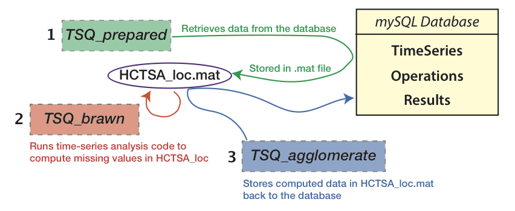

# Cycling through computations using runscripts

As described in this section, computation involves three main steps:

The procedure involves three main steps:

1. Retrieve a set of time series and operations from (the **Results** table) of the database to a local Matlab file, **HCTSA\_loc.mat** (using `SQL_retrieve`).

2. Compute the operations on the retrieved time series in Matlab and store the results locally (using `TS_compute`).

3. Write the results back to the **Results** table of the database (using `SQL_store`).

<!--This computational workflow is represented schematically below:-->

<!---->

It is usually the most efficient practice to retrieve a small number of time series at each iteration of the `SQL_retrieve`–`TS_compute`–`SQL_store` loop, and distribute this computation across multiple machines if possible.
An example runscript is given in the code that accompanies this document, as `sample_runscript.m`, which retrieves a single time series at a time, computes it, and then writes the results back to the database in a loop.
This can be viewed as a template for runscripts that one may wish to use when performing time-series calculations across the database.

This workflow is well suited to distributed computing for large datasets, whereby each node can iterate over a small set of time series, with all the results being written back to a central location (the *mySQL* database).

By designating different sections of the database to cycle through, this procedure can also be used to (manually) distribute the computation across different machines.
Retrieving a large section of the database at once can be problematic because it requires large disk reads and writes, uses a lot of memory, and if problems occur in the reading or writing to/from files, one may have to abandon a large number of existing computations.