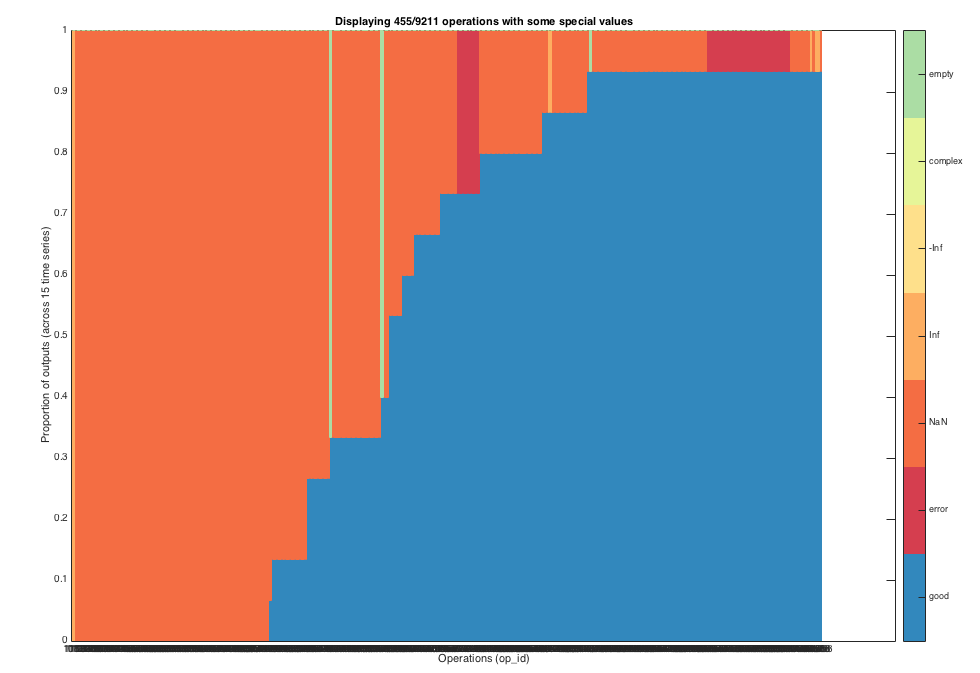

# Inspecting errors

When applying thousands of time-series analysis methods to diverse datasets, many operations can give results that are not real numbers. Some time series may be inappropriate for a given operation (such as fitting a positive-only distribution to data that is not positive), or measuring stationarity across 2000 datapoints in time series that are shorter than 2000 samples. Other times, an optimization routine may fail, or some unknown error may be called.

Some errors are not problems with the code, but represent issues with applying particular sets of code to particular time series, such as when a Matlab fitting function reaches the maximum number of iterations and returns an error. Other errors are genuine problems with the code that need to be corrected. Both cases are labeled as errors in our framework.

It can be good practice to visualize where special values and errors are occurring after a computation to see where things might be going wrong, using `TS_InspectQuality`. This can be run in four modes:

1. `TS_InspectQuality('summary');` \[default] Summarizes the proportion of special-valued outputs in each operation as a bar plot, ordered by the proportion of special-valued outputs.
2. `TS_InspectQuality('master');` Plots which types of special-valued outputs were encountered for each master operation.
3. `TS_InspectQuality('full');` Plots the full data matrix (all time series as rows and all operations as columns), and shows where each possible special-valued output can occur (including 'error', 'NaN', 'Inf', '-Inf', 'complex', 'empty', or a 'link error').
4. `TS_InspectQuality('reduced');` As `'full'`, but includes only columns where special values occurred.

For example, running `TS_InspectQuality('summary')` loads in data from **HCTSA.mat** and produces the following, which can be zoomed in on and explored to understand which features are producing problematic outputs:



## Errors with compiled code

Note that errors returned from Matlab files do not halt the progress of the computation (using `try-catch` statements), but errors with compiled **mex** functions (or external command-line packages like TISEAN) can produce a fault that crashes Matlab or the system. We have performed some basic testing on all mex functions, but for some unusual time series, such faults may still occur. These situations must be dealt with by either identifying and fixing the problem in the original source code and recompiling, or by removing the problem code.

## Troubleshooting errors

When getting information on operations that produce special-valued outputs (getting IDs listed from `TS_InspectQuality`), it can be useful to then test examples by re-running pieces of code with the problematic data. The function `TS_WhichProblemTS` can be used to retrieve time series from an _hctsa_ dataset that caused a problem for a given operation.

Usage is as follows:

```
% Find time series that failed for the operation with ID = 684.
[ts_ind, dataCell, codeEval] = TS_WhichProblemTS(684);
```

This provides the list of time series IDs (`ts_ind`), their time-series data vectors (`dataCell`), and the code to evaluate the given operation (in this case, the master operation code corresponding to the operation with ID 684).

You can then pick an example time series (e.g., the first problem time series: `x = dataCell{1}; x_z = zscore(x)`), and then copy and paste the code in codeEval into the command line to evaluate the code for this time series. This method allows easy debugging and inspection of examples of time-series data that caused problems for particular operations flagged through the `TS_InspectQuality` process.
