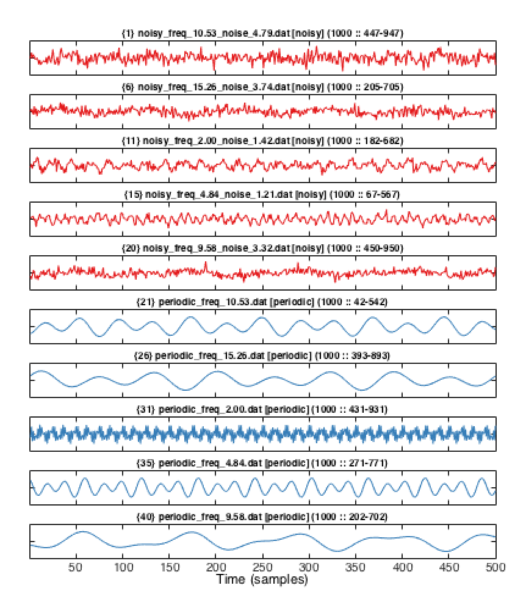

# Plotting the time series

The *hctsa* package provides a simple means of plotting time series: the `TS_PlotTimeSeries` function.

## Basic plotting

For example, to plot a set of time series that have not been assigned groups, we can run the following:
```matlab
    whatData = 'norm'; % Get data from HCTSA_N.mat
    plotWhatTimeSeries = 'all'; % plot examples from all time series
    plotHowMany = 10; % how many to plot
    maxLength = 400; % maximum number of samples to plot for each time series
    TS_PlotTimeSeries(whatData,plotHowMany,plotWhatTimeSeries,maxLength);
```
For our assorted set of time series, this produces the following:


Showing the first 400 samples of 10 selected time series, equally-spaced through the TimeSeries IDs in `HCTSA_N.mat`.

## Freeform plotting

Many more custom plotting options are available by passing an options structure to `TS_PlotTimeSeries`, including the `'plotFreeForm'` option which allows very many time series to be shown in a single plot (without the usual axis borders):
```matlab
    % Plot as a freeform plot without labeling time series:
    plotOptions = struct('plotFreeForm',true,'displayTitles',false);
    TS_PlotTimeSeries('norm',40,'all',300,plotOptions);
```


producing an overview picture of the first 300 samples of 40 time series (spaced through the rows of the data matrix).

## Dealing with groups of time series

When the time series have been assigned groups (using `TS_LabelGroups`, [here](grouping.md)), this information is automatically incorporated into `TS_PlotTimeSeries`, which then plots a given number of each time series group, and colors them accordingly:
```matlab
    numPerGroup = 5; % plot this many examples of each group of time series
    plotHow = 'grouped'; % plot examples of each assigned group of time series
    TS_PlotTimeSeries('norm',numPerGroup,plotHow,500);
```


In this case the two labeled groups of time series are recognized by the function: red (noisy), blue (no noise), and then 5 time series in each group are plotted, showing the first 500 samples of each time series.
