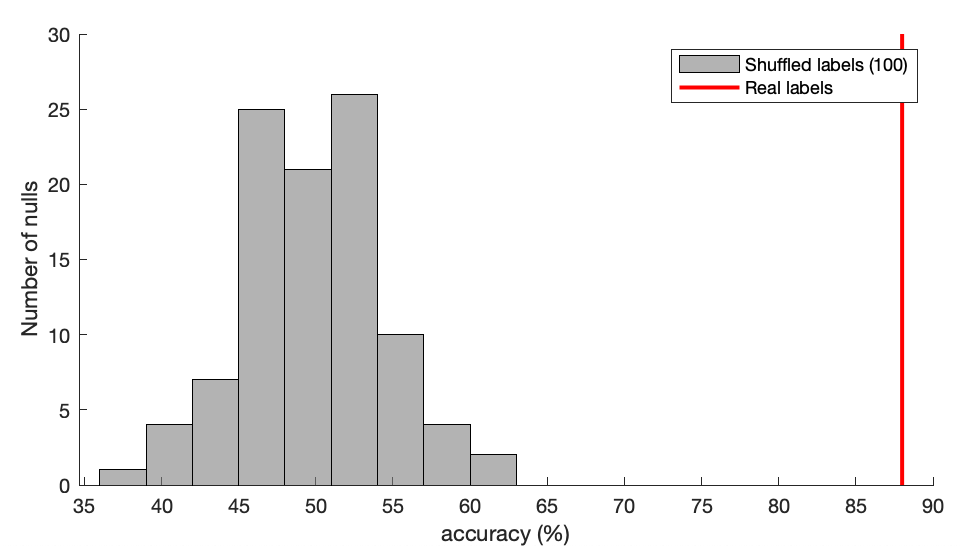

# Feature-based time-series classification

When performing a time-series classification task, a basic first exploration of the data is to investigate how accurately a classifier can learn a mapping from time-series features to labels assigned to time series in your dataset.

The first step is to assign group labels to time series in your dataset using [`TS_LabelGroups`](grouping.md).

Depending on the classifier, you typically want to first normalize the features to put them all on a similar scale (using `TS_Normalize`).

Depending on the question asked of the data, you should also consider whether certain types of features should be removed.
For example, you may wish to exclude length-dependent features (if differences in time-series length vary between classes but are an uninteresting artefact of the measurement).
This can be done using `TS_Subset` (and functions like `TS_CompareFeatureSets` described below allow you to test the sensitivity of these results).

## Classifying labeled groups (`TS_Classify`)

`TS_Classify` uses all of the features in a given _hctsa_ data matrix to classify assigned class labels.

### Setting properties of the classification

You can set classification settings, from the number of folds to use in cross-validation to the type of classifier, as the `cfnParams` structure.
For the labeling defined in a given `TimeSeries` table, you can set defaults for this using `cfnParams = GiveMeDefaultClassificationParams('norm')` (takes `TimeSeries` labeling from `HCTSA_N.mat`).
This automatically sets an appropriate number of folds (for cross-validation), and includes settings for taking into account class imbalance in classifier training and evaluation.
It is best to alter the values inside this function to suit your needs, such that these settings can be applied consistently.

### Computing classification accuracy

First let's run a simple classification of the groups labeled in `HCTSA_N.mat`, using default classification settings:

```matlab
TS_Classify('norm')
```

In large feature spaces like in _hctsa_, simpler classifiers (like `'svm_linear'`) tend to generalize well, but you can play with the settings in `cfnParams` to get a sense for how the performance varies.

As well as the classification results, the function also produces a confusion matrix, which is especially useful for evaluating where classification errors are occurring.
Here's an example for a five-class problem:


### Assessing significance as a permutation test relative to a shuffled ensemble

In datasets containing fewer time series, it is more likely to obtain high classification accuracies by chance.
You may therefore wonder how confident you can be with your classification accuracy.
For example if you get a two-class classification accuracy of 60%, you might wonder what the probability is of obtaining such an accuracy by chance?

You can set `numNulls` in `TS_Classify` to iterate over the classification settings defined in `cfnParams` except using shuffled class labels.
This builds up a null distribution from which you can estimate a _p_-value to infer the significance of the classification accuracy obtained with the true data labeling provided.

You can also choose to run across multiple cores by switching on `doParallel`:

```matlab
numNulls = 100;
dataFile = 'HCTSA_N.mat';
cfnParams = GiveMeDefaultClassificationParams(dataFile);
TS_Classify(dataFile,cfnParams,numNulls,'doParallel',true)
```

This gives you a _p_-value estimate (both via a direct permutation test, and by assuming a Gaussian null distribution), and plots the null distribution with the true result annotated:



## Comparing feature sets

### Specific feature sets (`TS_CompareFeatureSets`)
You might wonder whether the classification results are driven by simple types of features that aren't related to time-series dynamics at all (such as the mean of the data, or time-series length).

These can be filtered out from the initial computation (e.g., when performing `TS_Init`), or subsequently (e.g., using `TS_Subset`), but you can test the effect such features are having on your dataset using `TS_CompareFeatureSets`.
Here's an example output:


Here we see that length-dependent features are contributing to accurate classification (above-50% accuracy for this two-class balanced problem).
We can take some relief from the fact that excluding these features (`'notLengthDependent'`) does not significantly alter the classification accuracy, so these features are not single-handedly driving the classification results.
Nevertheless, assuming differences in recording length is not an interesting difference we want to bias our classification results, it would be advisable to remove these for peace of mind.

## Comparing to lower-dimensional feature spaces

The complexity of the time-series analysis literature is necessary for strong classification results to different degrees, depending on the task.
You can quickly assess how accurately a smaller number of reduced components (e.g., Principal Components) can better classify your dataset using `TS_Classify_LowDim`:


The classification accuracy is shown for all features (green, dashed), and as a function of the number of leading PCs included in the classifier (black circles).
Note that this is cumulative: '5 PCs' means classification in the five-dimensional space of the five leading PCs.

Here we find that we can get decent classification accuracy with just four PCs (and perhaps even more complex classifiers will give even better results in the lower-dimensional spaces).

You can quickly interpret the type of features loading strongly onto each PC from the information shown to screen.
For example:

```
---Top feature loadings for PC5---:
(0.048, r = 0.65) [116] AC_24 (correlation)
(0.048, r = 0.64) [115] AC_23 (correlation)
(0.047, r = 0.64) [117] AC_25 (correlation)
(0.046, r = 0.62) [114] AC_22 (correlation)
(0.045, r = 0.61) [118] AC_26 (correlation)
```

Demonstrates that, on this dataset, long-lag autocorrelations are the most strongly correlated features to PC5.
