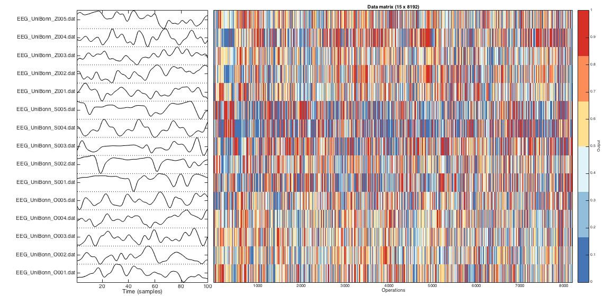
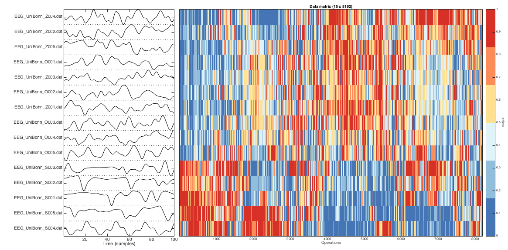
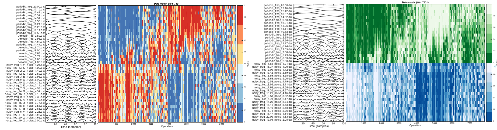

# Visualizing the data matrix using `TS_PlotDataMatrix`

The clustered data matrix (if clustering has been performed, otherwise the non-clustered data matrix is used) can be visualized by running

        TS_PlotDataMatrix

This will produce a colored visualization of the data matrix such as that shown below.

When data is grouped according to a set of distinct keywords and stored as group metadata (using the `TS_LabelGroups` [function](grouping.md)), these can also be visualized using `TS_PlotDataMatrix('colorGroups',1)`.

<!-- ## Example usage

For example, we used a set of 9000 operations on 100 diverse empirical time series.
We then:
1. Normalized it, using `TS_Normalize('scaledRobustSigmoid',[0.7,0.9])`. This removed 1 time series with fewer than 70% good values, 2476 operations with fewer than 90% good values, 164 operations with near-constant outputs, and 114 operations with zero interquartile range, leaving a 99 x 7225 normalized data matrix containing 0.38% special values saved in **HCTSA_N.mat**.
2. Clustered it, using `TS_Cluster('euclidean','average', 'corr_fast', 'average')`, which uses a faster approximation for correlations involving bad values. The result is a re-ordered data matrix and associated metadata saved in **HCTSA_N.mat**. -->

### Visualizing the normalized (unclustered) data matrix
Running `TS_PlotDataMatrix('norm')` plots the data contained in the local file `HCTSA_N.mat`, yielding:



where black rectangles label missing values, and other values are shown from low (blue) to high (red) after normalization using the scaled outlier-robust sigmoidal transformation.
Due to the size of the matrix, operations are not labeled.

Examples of time series segments are shown to the left of the plot, and when the middle plot is zoomed, the time-series annotations remain matched to the data matrix:


### Visualizing the clustered data matrix

It can be useful to display the matrix with the order of time series and operations preserved, but the relationships between rows and columns can be difficult to visualize when ordered randomly.

By running `TS_PlotDataMatrix('cl')`, the clustering information contained in `HCTSA_N.mat` is used to reorder the time series and features by similarity (if this information exists, cf. [`TS_Cluster`](clustering_rows_and_columns.md)), yielding:



By reordering rows and columns, this representation reveals correlated patterns of outputs across different types of operations, and similar sets of properties between different types of time series.

## Example: Incorporating group information

In this example, we consider a set of 20 periodic and 20 noisy periodic signals.
We assigned the time series to groups (using `TS_LabelGroups('orig',{'periodic','noisy'},'ts')`), normalized the data matrix (`TS_Normalize`), and then clustered it (`TS_Cluster`).
So now we have a clustered data matrix containing thousands of summaries of each time series, as well as pre-assigned group information as to which time series are periodic and which are noisy.
When the time series have been assigned to groups , this can be accessed by setting the second input to 1:

```matlab
    TS_PlotDataMatrix('cl','colorGroups',false); % don't color according to group labels
    TS_PlotDataMatrix('cl','colorGroups',true); % color according to group labels
```
producing the following two plots:



When group information is *not used* (the left plot), the data is visualized in the default blue/yellow/red color scheme, but when the assigned groups are colored (right plot), we see that the clustered dataset separates perfectly into the periodic (green) and noisy (blue) time series, and we can visualize the features that contribute to the separation.
